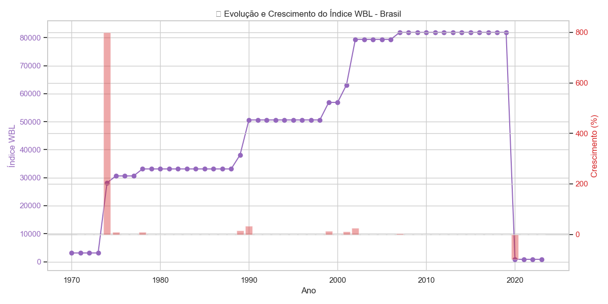
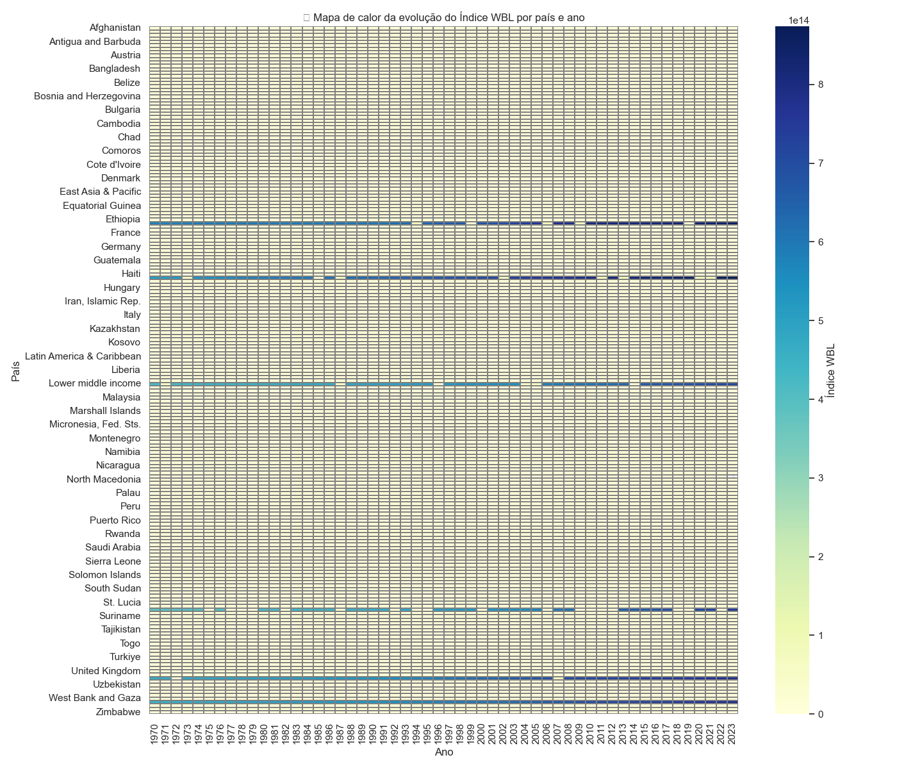
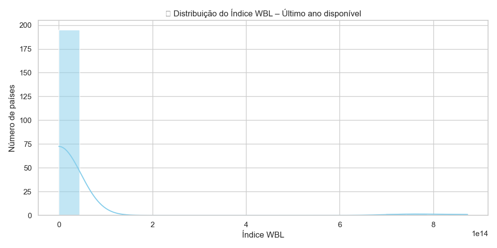
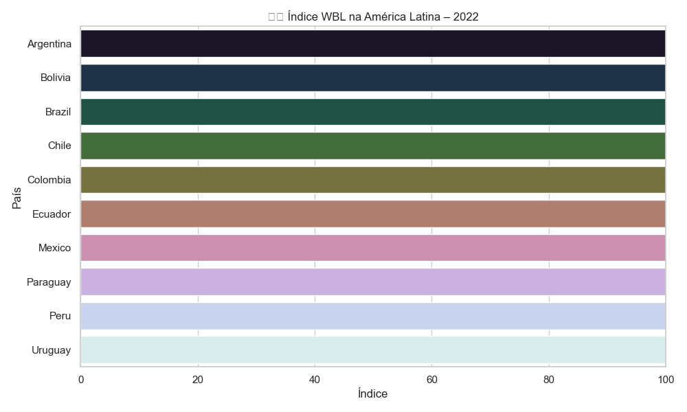

Claro! Abaixo está o seu `README.md` **refatorado e totalmente estruturado**, agora integrando todos os **novos gráficos** e mantendo uma organização clara, ideal para publicação em repositórios como GitHub, portfólio pessoal ou até documentação técnica.

---

# 📊 Projeto: Análise Global do Índice de Igualdade Legal para Mulheres (WBL Index)

Este projeto analisa a evolução do **Women, Business and the Law Index Score (WBL Index)** — um indicador do Banco Mundial que avalia como leis e regulamentos afetam a vida econômica das mulheres em diferentes países.

---

## 🧠 Sobre o Índice WBL

* **Fonte:** [World Bank Data360 – WBL Index](https://data360.worldbank.org/en/indicator/WB_WBL_SG_LAW_INDX)
* **Descrição:** O índice varia de **0 a 100**, sendo 100 o valor que representa a maior igualdade legal entre homens e mulheres.
* **Composição:** Média de 8 pilares:

  * Mobilidade
  * Local de trabalho
  * Remuneração
  * Casamento
  * Parentalidade
  * Empreendedorismo
  * Propriedade de ativos
  * Aposentadoria

---

## 🎯 Objetivos

* Avaliar o progresso legal em igualdade de gênero por país e ao longo do tempo
* Identificar países líderes e atrasados no ranking
* Exportar dados tratados para visualizações interativas no Power BI
* Oferecer um painel completo com gráficos, análises e storytelling

---

## 📁 Estrutura do Projeto

```
wbl_index_projeto/
├── dados/
│   └── wbl_raw.csv              # Dados brutos do Banco Mundial
├── export/
│   ├── wbl_tratado.csv         # CSV tratado para Power BI
│   ├── evolucao_brasil.png
│   ├── evolucao_crescimento_brasil.png
│   ├── top10_wbl_global.png
│   ├── mapa_calor_wbl.png
│   ├── distribuicao_wbl.png
│   └── latam_wbl_2022.png
├── relatorio/
│   └── relatorio_wbl.pdf       # Relatório em PDF com storytelling
├── powerbi/
│   └── dashboard.pbix          # Dashboard Power BI
├── script.ipynb                # Script de tratamento e análise
└── README.md
```

---

## 📤 Dados Exportados

O arquivo `wbl_tratado.csv` contém os seguintes campos:

| país   | ano  | índice\_wbl | variação\_anual | crescimento\_pct |
| ------ | ---- | ----------- | --------------- | ---------------- |
| Brazil | 2008 | 75.0        | NaN             | NaN              |
| Brazil | 2009 | 78.75       | 3.75            | 5.00             |

Este dataset pode ser utilizado diretamente em ferramentas de BI como Power BI ou Tableau.

---

## 📊 Análises e Visualizações

### 📊 1. Evolução + Crescimento Percentual do Índice (Brasil)



---

### 🌍 2. Top 10 Países com Maior Índice (último ano)


---

### 🔥 3. Mapa de Calor Global por País e Ano



---

### 📉 4. Distribuição do Índice WBL – Último Ano



---

### 🌎 5. Comparação entre Países da América Latina – 2022



---

## 📈 Integração com Power BI

No Power BI, foram criadas as seguintes visualizações:

* **Segmentações por ano e país**
* **Cartões com KPIs**: índice médio, crescimento, país com melhor performance
* **Gráficos de linha, barras e ranking**
* **Mapa mundial de calor interativo**

📷 *\[Adicione aqui screenshots do seu Power BI]*

---

## 🧠 Insights Extraídos

* O Brasil melhorou significativamente até 2019, mas **estagnou nos anos seguintes**.
* **Países da Europa** ocupam o topo do ranking.
* **Oriente Médio e África Central** concentram os índices mais baixos.
* A América Latina é heterogênea: Brasil, Chile e Uruguai lideram.

---

## 📚 Referência

> *The index measures how laws and regulations affect women’s economic opportunity. Overall scores are calculated by taking the average score of each index (Mobility, Workplace, Pay, Marriage, Parenthood, Entrepreneurship, Assets and Pension), with 100 representing the highest possible score.*
> — World Bank

---

## 👤 Autor

**Luiz Ricardo Garcia**
📧 \[[ricardogarcia.py.data@gmail.com](mailto:ricardogarcia.py.data@gmail.com)]
🔗 [LinkedIn](https://linkedin.com/in/lricardogarcia)
🐙 [GitHub](https://github.com/lricardogarcia)

---

## 📄 Licença

Este projeto utiliza dados públicos do Banco Mundial e pode ser usado livremente para fins acadêmicos e educacionais.
