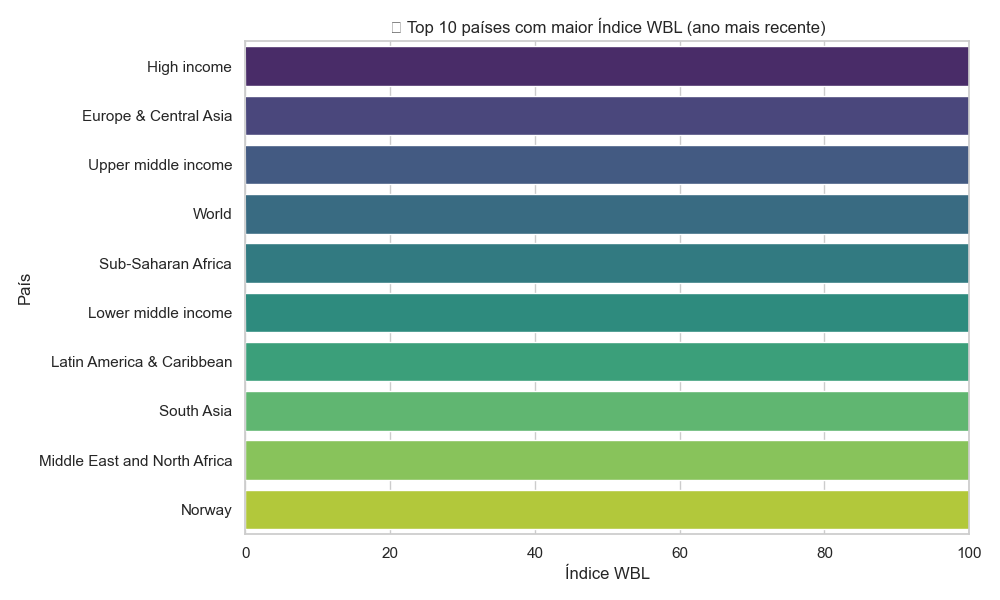
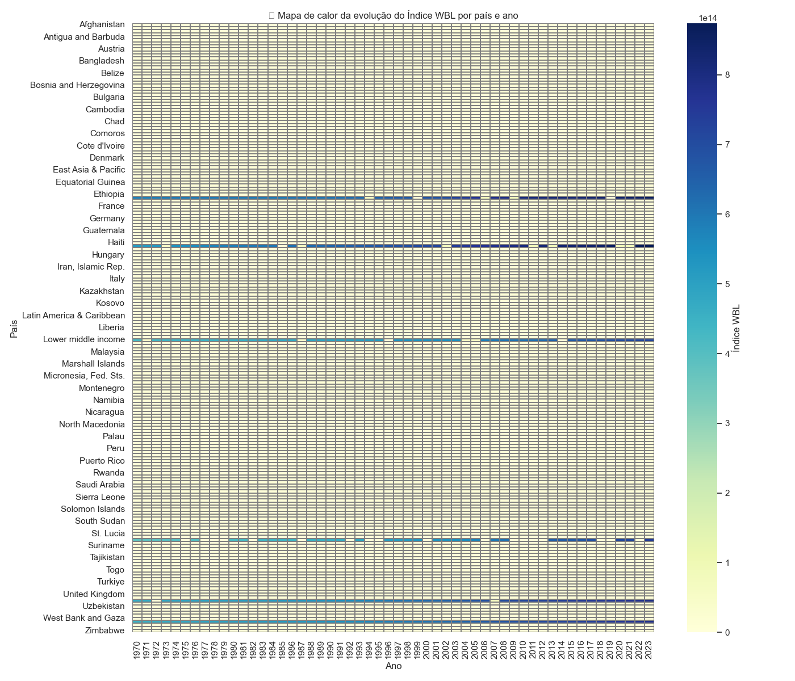
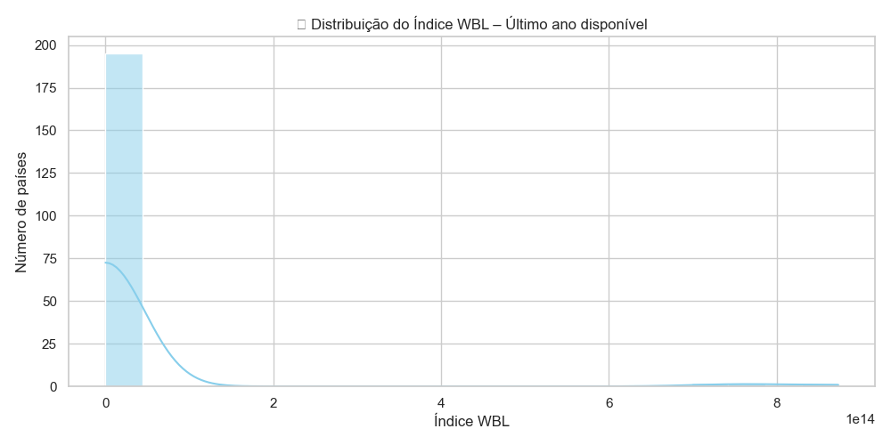

# Global Analysis of the Legal Gender Equality Index (WBL Index)

This project analyzes the evolution of the **Women, Business and the Law Index (WBL Index)** — a World Bank indicator that evaluates how laws and regulations affect women's economic participation across different countries.

---

## 🧠 About the WBL Index

- **Source:** [World Bank Data360 – WBL Index](https://data360.worldbank.org/en/indicator/WB_WBL_SG_LAW_INDX)
- **Scale:** 0 to 100, where 100 represents full legal equality between men and women.
- **Components:** The index is the average of 8 key dimensions:
  - Mobility  
  - Workplace  
  - Pay  
  - Marriage  
  - Parenthood  
  - Entrepreneurship  
  - Asset Ownership  
  - Retirement  

---

## 🎯 Objectives

- Evaluate legal progress in gender equality by country and over time
- Identify top-performing and underperforming countries
- Export processed datasets for BI tools like Power BI
- Create a full analytical dashboard with insights and storytelling

---

## 📁 Project Structure

```

wbl\_index\_projeto/
├── dados/                      # Raw data from World Bank
│   └── wbl\_raw\.csv
├── export/                     # Processed data and visualizations
│   ├── wbl\_tratado.csv
│   ├── evolucao\_brasil.png
│   ├── evolucao\_crescimento\_brasil.png
│   ├── top10\_wbl\_global.png
│   ├── mapa\_calor\_wbl.png
│   ├── distribuicao\_wbl.png
│   └── latam\_wbl\_2022.png
├── relatorio/
│   └── relatorio\_wbl.pdf       # Insight report (in Portuguese)
├── powerbi/
│   └── dashboard.pbix          # Power BI dashboard file
├── script.ipynb                # Data processing and analysis notebook
└── README.md

```

---

## 📤 Exported Data

The `wbl_tratado.csv` file contains the following fields:

| country | year | wbl_index | yearly_change | growth_pct |
|---------|------|-----------|----------------|-------------|
| Brazil  | 2008 | 75.0      | NaN            | NaN         |
| Brazil  | 2009 | 78.75     | 3.75           | 5.00        |

This dataset is ready for direct use in BI tools like **Power BI or Tableau**.

---

## 📊 Analyses and Visualizations

### 📈 1. Brazil – Index Evolution and Growth Percentage


---

### 🌍 2. Top 10 Countries by WBL Index (Latest Year)


---

### 🔥 3. Global Heatmap by Country and Year


---

### 📉 4. WBL Index Distribution – Latest Year


---

### 🌎 5. Latin America Country Comparison – 2022


---

## 🧠 Extracted Insights

- Brazil significantly improved until 2019 but plateaued afterward.
- European countries lead the index with the highest scores.
- The Middle East and Central Africa have the lowest legal equality scores.
- Latin America is diverse: Brazil, Chile, and Uruguay are the top performers in the region.

---

## 📚 Reference

> *"The index measures how laws and regulations affect women’s economic opportunity. Overall scores are calculated by taking the average score across 8 domains: Mobility, Workplace, Pay, Marriage, Parenthood, Entrepreneurship, Assets and Pension, with 100 representing the highest possible score."*  
> — World Bank

---

## 👤 Author

**Luiz Ricardo Garcia**  
📧 [ricardogarcia.py.data@gmail.com](mailto:ricardogarcia.py.data@gmail.com)  
🔗 [LinkedIn](https://linkedin.com/in/lricardogarcia)  
🐙 [GitHub](https://github.com/lricardogarcia)

---

## 📄 License

This project uses public data from the World Bank and is free to use for educational and academic purposes.

